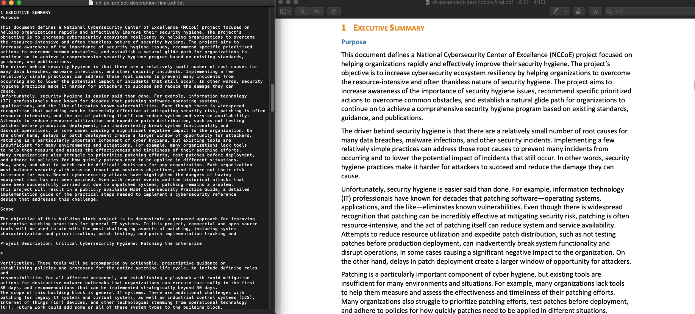

# Parse_PDF
example of parse pdf project for uq industrial capstone project
  This project uses the pdfminer repository to parse pdf files, and i've download two security white paper from https://csrc.nist.gov/publications/white-paper,
and it works well.
# Requirements
- python3
- pip install -r requirement.txt

# Run
python main.py <file_path>
 #python main.py './White Paper'

# Result 
The result will be saved in the result folder.
The result looks like this.
